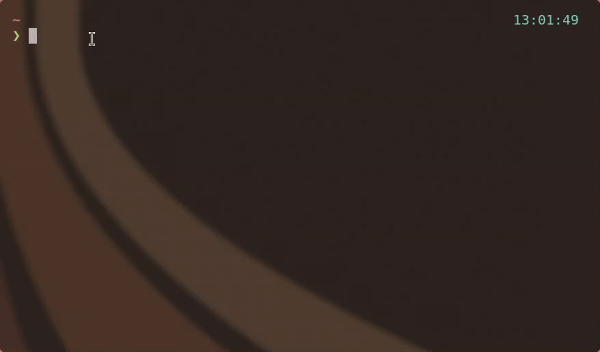
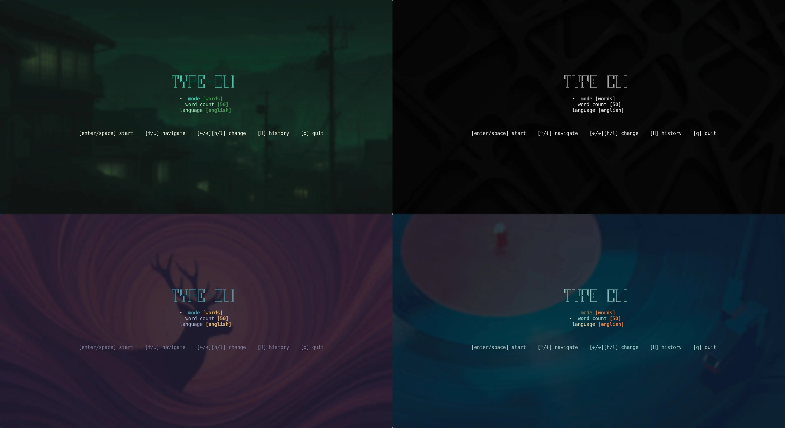

<pre>
╔╦╗╦ ╦╔═╗╔═╗   ╔═╗╦  ╦
 ║ ╚╦╝╠═╝║╣  ═ ║  ║  ║
 ╩  ╩ ╩  ╚═╝   ╚═╝╚═ ╩
</pre>

# Typing Speed Test for the Terminal

A fast, responsive terminal-based typing speed test built with Go, Bubble Tea, and Lipgloss. Supports timed and word-count modes, multiple word lists, per-character accuracy coloring, and adaptive layout down to 30-column terminals.





## Install

**Linux / macOS:**

```bash
curl -fsSL https://raw.githubusercontent.com/Camilo-845/type-cli/main/install.sh | bash
```

**Windows (PowerShell):**

```powershell
irm https://raw.githubusercontent.com/Camilo-845/type-cli/main/install.ps1 | iex
```

Installs `tcli` to `~/.local/bin`. Ensure it's in your `PATH`. Only `curl` or `wget` required.

## Usage

```
$ tcli
```

| Key                    | Action                                                       |
| ---------------------- | ------------------------------------------------------------ |
| `space`                | Start test / submit word                                     |
| `h` / `l` or `←` / `→` | Cycle settings left/right                                    |
| `↑` / `↓`              | Navigate menu fields                                         |
| `backspace`            | Delete last character (on empty word: jump back to previous) |
| `tab`                  | History                                                      |
| `esc`                  | Back to menu                                                 |
| `q` / `ctrl+c`         | Quit                                                         |

## Game Modes

| Mode           | Options               |
| -------------- | --------------------- |
| **Timed**      | 15s, 30s, 60s, 120s   |
| **Word count** | 10, 25, 50, 100 words |

**Word lists:** English 200, English 1k

The test auto-completes on the last correct character of the last word — no trailing space needed.
